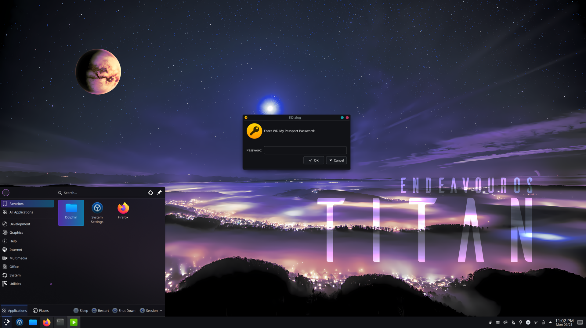

# WD My Passport Auto-Unlocker for KDE Plasma 6

[](LICENSE)
[](https://kde.org/plasma-desktop/)
[](PKGBUILD)
[](https://github.com/yongabyte/wd-passport-plasma-unlocker/actions)
[](https://www.opendesktop.org/p/2372790/)

**Your encrypted WD My Passport drive, minus the Windows-only unlock dance.**
Plug it in → a native password prompt pops up → type → Dolphin. No `sudo`, no root service, no extra runtime.


> **AUR status:** new-account registration is closed since June 2026 (malware cleanup, see `aur-general`). The `PKGBUILD`/`.SRCINFO` here are kept AUR-ready and will ship as `wd-passport-kdialog-unlocker` when it reopens. Until then, install from source or a Release below.

---

## The experience

1. **Plug in the USB cable.** A themed `kdialog` password box appears instantly, in your session, as your user.
2. **Typo?** No problem — it re-prompts in place (5 tries, cancel anytime) instead of making you hunt for a retry button.
3. **Dismissed it?** The Device Notifier keeps an **Unlock WD My Passport** action on the drive entry until you unplug. Terminal (`wd-passport-unlocker`) and `systemctl --user start wd-passport-unlocker.service` work too.

## Why it's nice

- **Zero-click popup** — `udev` + a `systemd` user unit fire the prompt the millisecond the drive appears. Nothing runs as root.
- **Looks like your desktop** — runs with your full session environment, so the prompt follows your Plasma theme, fonts, and dark mode.
- **Featherweight** — unlock-only C backend (~22KB) on system `libcrypto`. No extra runtime or bundled crypto.
- **Rootless by design** — `uaccess` for device access, `cap_sys_rawio` file capability for vendor SCSI opcodes. No `setuid`, no `sudo`.



---

## Install (pick one)

| Method | Command |
|---|---|
| From source (Arch) | `git clone https://github.com/yongabyte/wd-passport-plasma-unlocker.git && cd wd-passport-plasma-unlocker && makepkg -si` |
| From a Release | download `wd-passport-kdialog-unlocker-*.pkg.tar.zst`, then `sudo pacman -U wd-passport-kdialog-unlocker-*.pkg.tar.zst` |
| Via AUR (once registration reopens) | `yay -S wd-passport-kdialog-unlocker` |
| Browse on KDE Store | [opendesktop.org/p/2372790](https://www.opendesktop.org/p/2372790/) (showcase + Device Notifier action; full install via the methods above) |

Then:
```bash
systemctl --user daemon-reload
```
Unplug and replug the drive once — the prompt fires on device-add, so a drive already plugged in at login won't retrigger until reinserted.

**Dependencies** (handled automatically by the package): `kde-cli-tools` (`kdialog` for Plasma 6), `bash`, `openssl`. Build-only: `gcc`, `libcap`. Test-only: `criterion`.

---

## How it works (the 30-second version)

<details>
<summary><b>Click to expand the plumbing</b></summary>

1. **Kernel event (`udev`).** A whole-disk USB block device with Western Digital's vendor ID (`1058`) gets `TAG+="uaccess"` plus `ENV{SYSTEMD_USER_WANTS}` (`70-wd-passport.rules`). Partitions and the Passport's Virtual CD are excluded. The `70-` prefix is load-bearing: the tag must land before stock `71-seat` / `73-seat-late` rules, or no ACL is granted.
2. **Prompt (`bash` + `kdialog`).** The user unit runs `wd-unlocker.sh` as you, with your session env — hence the native theming. Wrong passwords loop via `kdialog --warningyesno` (configurable with `WD_UNLOCKER_MAX_ATTEMPTS`, default 5).
3. **Handshake (`SG_IO`).** The password goes over stdin into `wd-unlocker-backend` (`backend/src/`), which replays WD's status (`C0/45`) → Handy-Store (`D8`) → unlock (`C1/E1`) SCSI sequence with salted, iterated SHA-256 (UTF-16LE, system OpenSSL).
4. **Matching.** Accepts legacy `Western_Digital_My_*` and real-hardware `WD_My_Passport_*` serials on USB vendor `1058`.

</details>

### Non-standard enclosure?

Check yours with `lsusb` (want `ID 1058:...`), and if the vendor differs, edit `ATTRS{idVendor}` in `/usr/lib/udev/rules.d/70-wd-passport.rules`, then:

```bash
sudo udevadm control --reload-rules && sudo udevadm trigger
systemctl --user daemon-reload
journalctl --user -u wd-passport-unlocker.service -f   # watch it fire, no root needed
```

---

## Hack on it

```bash
make -C backend test   # 20 Criterion tests using published WD vectors
make -C backend        # builds backend/wd-unlocker-backend
printf '%s' "YOUR_PASSWORD" | ./backend/wd-unlocker-backend; echo "exit=$?"
```

No hardware attached: `no Western Digital Passport device found` (exit 2). Locked drive attached: exit 0 + `unlocked`.

---

## Contributing & License

Issues, ideas, and PRs welcome — fork and send them in.

**GPL-3.0-or-later.** See [`LICENSE`](LICENSE).
